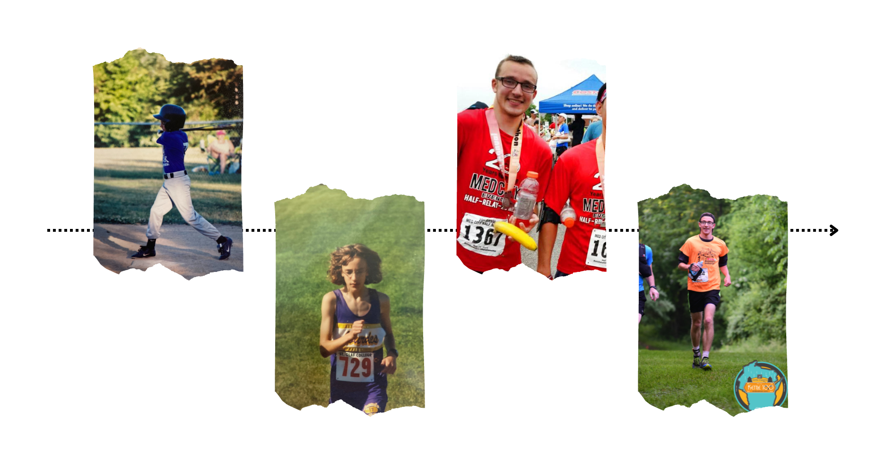
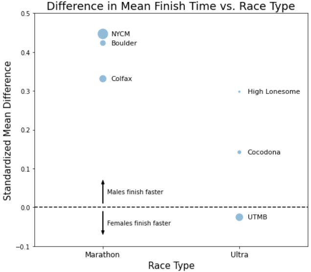
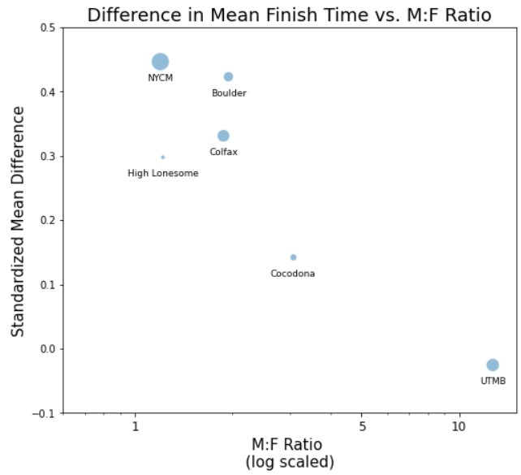
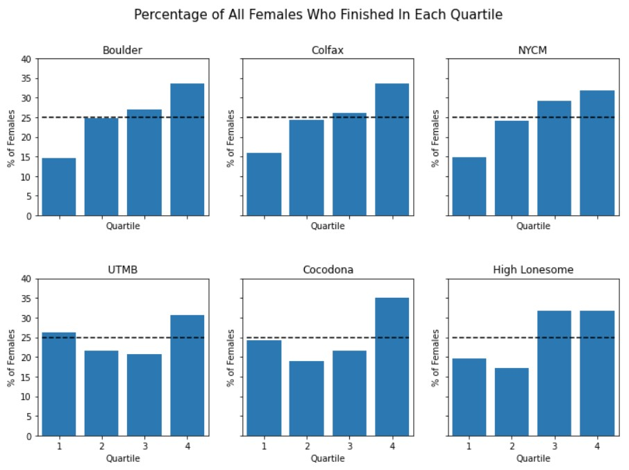
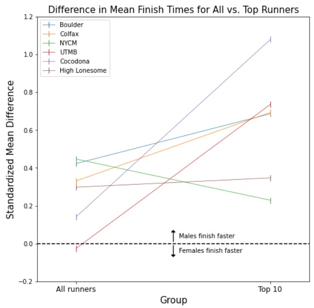

# Context & Question
I've loved running since I was little. First, it was chasing my friends around in gym class and playing sports. Then, it was joing the cross country team in 7th grade. Freshman year of college witnessed my first half marathon, and sophomore year my first marathon. By senior year, I had gotten sucked into the YouTube rabbit hole of trail running and ultramarathoning vlogs (an ultramarathon, or "ultra," for the uninitiated, is any event longer than the standardized 26.2 mile marathon distance). Confident in my YouTube-based ultra education, I decided to try my hand at trail running and completed my first 100 km race and then my first 100 mile race a few weeks after graduation.

    
     
    <i>From running the bases to running 100 miles.</i>

Despite my best efforts, I have never been remotely competitive at any of my running pursuits, but I love poring over stats from top runners' training and racing. An intriguing trend in race results moving from marathons into the world of ultramarathons is that you start to see women among the very top finishers. A classic example is Courtney Dauwalter's outright win in the 2017 Moab 240 Endurance Run (yes, that means 240 miles). Dauwalter was the first person to cross the finishing line by a staggering *ten hours*. Similar stories of women finishing among or ahead of the best men are not hard to find in ultrarunning, but are these performances outliers, or are female runners generally more competitive in the world of ultras? Some articles make cases for why females athletes might outperform males in extreme endurance events
(see, for example, this [BBC article](https://www.bbc.com/news/world-49284389)), and some studies have crunched the numbers to support these theories
(see [here](https://www.fitnessfirst.com.au/get-there/new-study-finds-women-are-better-at/#:~:text=Overall%2C%20the%20study%20found%20that,women%20come%20out%20on%20top.)), 
but the jury is still out. I decided to examine race results to dig deeper into this question:

> **Question:** How do female and male race results compare at marathon and ultramarathon distances? Does the gender performance gap shrink going from marathons to ultras?

# Data Collection
To begin my investigation, I needed data. Specifically, my goal was to web scrape the finish place, name, gender, and time for all runners in three marathons and three 100+ mile ultramarathons.
On a whim, I decided to start by scraping the results from the 2021 New York City Marathon. With Python as my programming language of choice, a quick Google search indicated that I needed to learn how to use Selenium, a popular tool for automated web page testing and web scraping. Suffice it to say, web scraping the race results of 24,950 runners is *not* how I recommend other users get started with Selenium. Along the way I learned the hard way that:
* Repeatedly hitting the "Load More" button on the bottom of the results page slows the webpage down dramatically when you are loading thousands of results, and
* Someone had the foresight to know a rookie like me would try to load too many results at once, and users are cut off from using the "Load More" button after the web page slows to a crawl and 10,000 results have been loaded.

After re-strategizing and a great deal of trial and error, I successfully scraped and stored the data for each and every runner. I naively thought that web scraping results for the remaining races would be straightforward, but each results page had a unique architecture and required me to add additional tricks to my repertoire. I wish I could say that web scraping is an art form I am starting to master, but it often seemed more like a game that layered on new rules every time I started to get the hang of it.

Finally, all my data was collected. Jupyter Notebook scripts for each web scrape and csv files of the results can be accessed [here](ADD LINK). The races are as follows:
1. 2021 Boulder Marathon. A small (< 400 finishers), less competitive marathon.
2. 2022 Colfax Marathon. A mid-size (~ 1000 finishers) marathon.
3. 2021 NYC Marathon. A large (~25,000 finishers), extremely competitive marathon.
4. 2021 Ultra-Trail du Mont-Blanc (UTMB). A large (~1500 finishers), competitive 106 mile ultra.
5. 2022 Cocodona 250. A small (~150 finishers) 250 mile ultra.
6. 2022 High Lonesome. A small (< 100 finishers) 100 mile ultra.

These races showcase a range of sizes and levels of competitiveness, with most races being close to home for me (Boulder, Colfax, and High Lonesome are all in Colorado, and Cocodona is in Arizona). Ultras are inherently much smaller than marathons due to the constraints of running on trails as opposed to streets, and because longer race distances tend to attract fewer runners.

While scraping the results, I elected to include only the results of runners who fully completed each race. This is important! In most marathons, less than 10% of runners who start the race drop out. For the New York City Marathon, this percentage is close to 1% many years. In many ultras, upwards of 30% of runners who start do not make it to the finish line. So, limiting my analysis to finishers may not be a big deal for marathons, but in ultramarathons it excludes many runners and may introduce a significant amount of bias. Why only include finishers then? One reason is that some races (the marathons and High Lonesome) only included information for finishers. There may be full information on all starters available, but I didn't see it. Another reason is that it is unclear how one analysis would cohesively integrate all the data from race finishers and those who dropped out. Looking at race drop outs could easily be an entire analysis of its own.

# Results
The unabridged analysis, with all its charts and statistical comparisons, can be accessed [here](ADD LINK). Here are the highlights:

### 1a. On average, female finish times are more competitive with male times in ultras.

    

Let's first explain what exactly "standardized mean difference" refers to.
The "mean difference" in finish times is the average female finish time minus the average male finish time. For example, the average female finisher at Cocodona took 2 hours longer than the average male finisher. The mean difference was then standardized to account for the fact that finishers in longer races tend to be more spread out (remember Courtney Dauwalter winning a race by 10 hours?). I chose to standardize the mean difference by dividing by the standard deviation of all finish times for the race. For example, the standard deviation of finish times at Cocodona was about 13 hours. The 2 hour mean difference divided by 13 hours yields the standardized mean difference (SMD) of 0.15 shown on the graph. The bubble size for each race represents the total number of runners.

The SMD for every marathon is larger than the SMD for every ultramarathon, indicating that female finish times are catching up to male finish times, relatively speaking, in longer races. The point for UTMB shows that the average finish time for females was actually faster than the average finish time for males! This trend lines up neatly with the headlines and anecdotes that motivated this investigation.

    <b>The Fine Print:</b>
Applying Welch's t-test indicates that the difference between male and female finish times is statistically significant for every marathon but none of the ultramarathons. Looking at female finish times as a percentage of male finish times tells a similar story. That is two more points in support of the claim that female finish times are more competitive in ultras. However, note that finish time distributions look entirely different for marathons and 100+ mile ultras. Marathon times follow a quasi-normal distribution skewed to the right, whereas ultra times are skewed very heavily to the left. Most statistical tools are not designed to compare such starkly different distributions, so take all these findings with a grain of salt.

### 1b. But, there may be alternate explanations.
In talking to a friend about my investigation, she pointed out an important consideration that is often ignored when looking at outstanding female performance in ultra endurance events. As the length, intensity, and prestige of a race increases, fewer runners choose to participate. This self selection bias means trends in results from longer races cannot be generalized to the larger population of runners. In particular, if women, more than men, tend to only enter races that they feel highly qualified for, the female runners will tend to be more elite than the male runners. I don't know of any studies investigating gendered self selection bias in running, but there are parallel findings in other fields. For instance, a LinkedIn 
[Gender Insights Report](https://www.linkedin.com/business/talent/blog/talent-acquisition/how-women-find-jobs-gender-report) 
found that women are more selective in what jobs they apply to and are hired more frequently when they do apply.

Since we have already seen that, by some metrics, women are more competitive in longer races, one might wonder, "Are females being more selective in what races they participate in?" In short, probably. Race results give us no direct information about how selective males and females are in their race choices, but we can use the balance of male and female runners as a proxy. In the NYCM, the race with the largest SMD in gender finish times, the gender balance was the closest to even: 20% more finishers were male than female. In contrast, UTMB had *over 1100%* more male finishers than female finishers. This suggests that women are much more selective about entering UTMB than the NYCM.

    

Plotting the SMDs against the ratio of males to females, we see a suggestive downward trend. As the proportion of female runners decreases, so does the SMD. Perhaps self selection bias is driving down SMDs and making it appear that women excel at longer race distances. Perhaps there is a combination of self selection bias and natural ability driving the trends. Perhaps there is an entirely separate explanation!

    <b>The Fine Print:</b>
My goal here is NOT to naysay the theory and evidence that women excel at ultra endurance events. Rather, I want to present all sides of the story and consider competing explanations. All claims are speculation based on a small sample of races. I am speculating in an educated fashion using appropriate statistical tools, but with full knowledge that a more comprehensive analysis might not support all findings.

### 2. In marathons, fewer women finish in the front. In ultras, fewer women finish in the middle.
The distribution of female finishers looks distinctly different in marathons and in ultras.

    

In the marathons analyzed, the number of women steadily increases as you look farther down the finisher list. The smallest percentage of females finished in the top 25% of finishers, and the largest percentage of females finished in the bottom 25%. However, in every ultra analyzed, there were more female finishers in Q1 than in Q2. Again, though, the largest percentage of women finished in Q4.

### 3. When you consider only the top runners of each gender, female finish times don't catch up to males' for longer races
This contrasts with what we just saw in **2**, and with some of anecdotal evidence that women excel at ultra endurance events. If women are innately more competitive at longer distances, one might expect that the gap between the best female finish times and the best male finish times decreases in longer races.

    

On the left, the graph shows the same information as first graph about standardized mean differences, **1a**. The right shows a new set of SMDs, now considering only the top 10 runners of each gender*. The gap between finish times for top 10 females vs. top 10 males tends to be larger than the gap for all runners. Additionally, now a marathon (NYCM) shows the smallest SMD and an ultra (Cocodona) shows the largest SMD.

    

    *However, note that the standard deviation used in the calculation was still the standard deviation of all finish times. See below for more.
    

    <b>The Fine Print:</b>
This part of my analysis may be the shakiest, and if you object to my methods or conclusions, please let me know! Is it fair to compare the same number of female and male finishers when the races have so many more male participants? I believe the top 10 males and top 10 females in each race are all likely to be the best of the best, but maybe a better comparison is to include more males to match each race's gender balance. In addition, the decision to standardize mean differences by dividing by the standard deviation of times for all runners could be called into question. Maybe the standard deviation of only the 20 times under consideration would be more appropriate.

    
# Future Directions
This investigation confirmed the common wisdom that females are more competitive with males at long ultras than at marathons, but it also highlighted nuances that don't make the headlines. The most accurate statement I can make might be, "the females who are choosing to participate in long races are more competitive at extreme distances." It seems plausible that the females choosing to participate in 100+ mile races tend to be more elite in comparison to the males, highlighting a need for better understanding the mechanisms at work, including biological factors as well as selection bias. I would like to see the same comparisons I conducted repeated with a larger number and variety of races to see which trends hold up under closer scrutiny. A study of how male and female runners decide which races to participate in would also be valuable, especially a mixed methods study pursuing both quantitative and qualitative lines of inquiry. Given that marathons and ultramarathons also tend to differ in many more ways than distance (e.g. terrain, fueling requirements, location), it would be fascinating to try and tease apart which factors contribute the most to differences in gender performance.

  

Let me know comments and questions you have! Feel free to reach out on <a href=https://www.linkedin.com/in/ianmcmeeking/>LinkedIn</a>.

